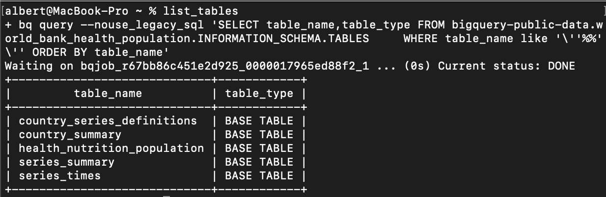
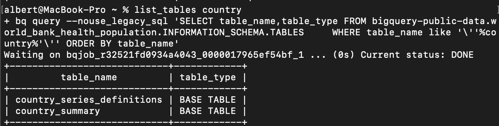
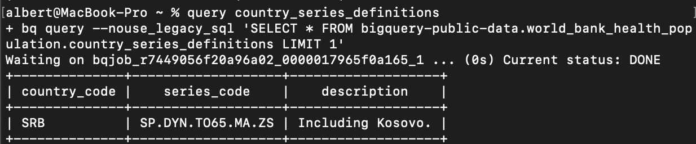
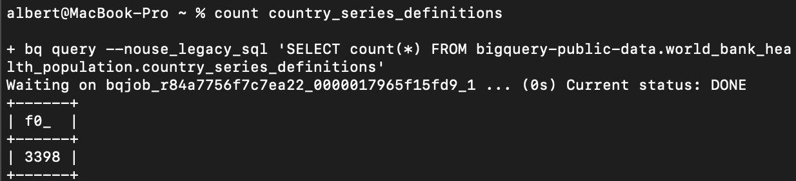
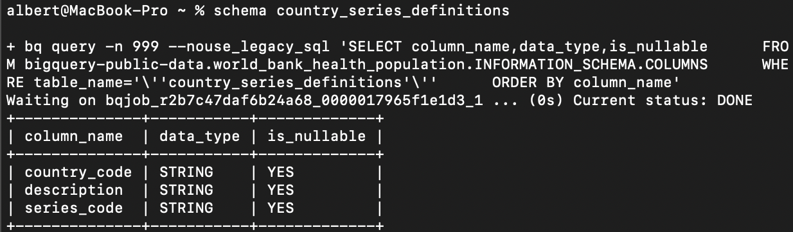

# Easy Data
Quick tools save your daily data analysis workload, making life easier.

Support BigQuery in GCP now.

# Features
- List and search tables in specific dataset
- Query records and schema quickly
- Print command for further modification

# Prerequisites
The script require following tools to be pre-installed.
- Google SDK
- Bash
- Git

# Quickstart

    git clone --depth 1 -b main git@github.com:23hp/easy-data.git
    chmod +x easy-data/shell/*
    export PATH="$PATH:$(pwd)/easy-data/shell"

# Usage
Tips: Press `Tab` key for command auto complete.

## List Tables

List all tables under specific dataset. Dataset and project id can be changed in shell/set_config

    list_tables

## Table Searching

    # list_tables [keywords] 
    # e.g. list table names contains 'country'
    list_tables country

## Table Query

    # query [table_name]
    # e.g. show a records from table 'country_series_definitions'
    query country_series_definitions

## Records count

    # count [table_name]
    # e.g. show records count of table 'country_series_definitions'
    count country_series_definitions

## Show table schema

    # schema [table_name]
    # e.g. show schema of table 'country_series_definitions'
    schema country_series_definitions

## Table Analysis
TODO

# Installation
TODO